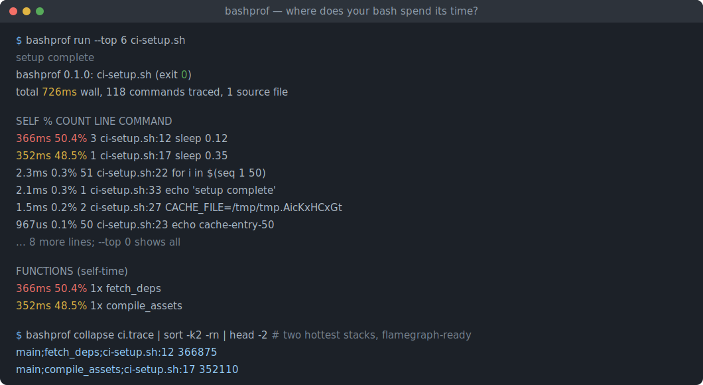
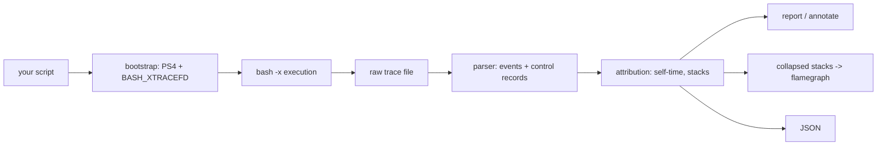

# bashprof

[English](README.md) | [中文](README.zh.md) | [日本語](README.ja.md)

[](LICENSE) [](Cargo.toml)  [](CONTRIBUTING.md)

**bash の行単位タイムプロファイラ（オープンソース）——スクリプトがどの行に時間を使っているかを正確に可視化し、フレームグラフ対応の出力まで。**



```bash
git clone https://github.com/JaydenCJ/bashprof.git && cargo install --path bashprof
```

## なぜ bashprof か？

CI のセットアップスクリプト、dotfiles、デプロイスクリプトは毎日数分を浪費しているのに、*どこで*かは誰も知りません。`time` は実行全体に対して不透明な数字を 1 つ返すだけ。10 年間 gist で受け継がれてきた民間療法——`PS4='+ $EPOCHREALTIME ' bash -x`——は数千行の生トレースを stderr に吐き出し、引き算も集計もループ回数も全部あなた任せです。bashprof はこのトリックを製品化しました。1 コマンドでスクリプトを無改変のまま実行し、行単位の self-time 表、実行回数、関数別集計、耗時付きソース一覧、そして任意のフレームグラフツールにそのまま渡せる collapsed stacks を返します。スクリプトは自分の `$0`・引数・stderr・終了コードを保持するため、CI ステップを bashprof で包んでも挙動は変わりません。

|  | bashprof | `time`（ビルトイン） | `PS4=$EPOCHREALTIME` 民間療法 |
|---|---|---|---|
| 行単位 self-time | yes、`file:line` で集計 | no（全体のみ） | 生タイムスタンプ、引き算は手作業 |
| ループ/呼び出し回数 | yes（`COUNT` 列 + 関数別呼び出し数） | no | 自分で行を数える |
| 関数スタック + フレームグラフ | yes（`collapse`、リーフは `file:line`） | no | no |
| スクリプトの stderr は無傷 | yes（トレースは専用 fd へ） | yes | no（xtrace が stderr を氾濫させる） |
| 厳格モード（`set -u`、`IFS=$'\n\t'`） | 対応済み | n/a | 壊れる（展開が無防備） |
| root / コンテナ内で動作 | yes | yes | 静かに無効化（bash ≥5 は root の環境 `PS4` を無視） |
| 終了コードの透過 | yes | yes | yes |

## 特徴

- **1 コマンド、スクリプト無改変** —— `bashprof run ./setup.sh args...` はスクリプト自身の `$0`・位置パラメータ・stdin/stdout/stderr・終了コードを保持。トレースは `BASH_XTRACEFD` 経由の専用ファイルディスクリプタに流れるため、自分の stderr を検査するスクリプトすら通常どおり動きます。
- **行ごとの self-time、誠実な帰属** —— 関数を呼ぶ行にはディスパッチ分だけを計上し、呼ばれた側の行は各自の時間を持つので、数字は二重計上なしに合計と一致します。
- **フレームグラフ即応の collapsed stacks** —— `bashprof collapse` は `main;fetch_deps;setup.sh:12 366875` 形式・リーフフレーム `file:line` の行を出力。`flamegraph.pl`、inferno、speedscope にそのまま渡せます。
- **ソース注釈** —— `bashprof annotate` はスクリプト各行の左に時間と回数を表示。未実行の行は空欄のままなので、行カバレッジビューとしても使えます。
- **現実世界の bash に耐える** —— 厳格モード（`set -euo pipefail`、`IFS=$'\n\t'`）、ロケールのカンマ小数点、ユーザー自身の EXIT trap、サブシェル、コマンド置換、バックグラウンドジョブ、root/CI 環境をすべて処理しテスト済み。
- **生トレースの再解析** —— `--out` でトレースを保存（形式は `docs/trace-format.md`）。`report`・`collapse`・`annotate` がオフラインで再解析でき、`--json` は安定した機械可読出力を提供します。

## クイックスタート

インストール（ビルドに Rust 1.75+、実行時は `EPOCHREALTIME` のため bash 5.0+ が必要）：

```bash
git clone https://github.com/JaydenCJ/bashprof.git && cargo install --path bashprof
```

同梱サンプルをプロファイル：

```bash
bashprof run --top 6 examples/ci-setup.sh
```

実際の出力：

```text
setup complete
bashprof 0.1.0: examples/ci-setup.sh (exit 0)
total 774ms wall, 118 commands traced, 1 source file

     SELF       %   COUNT  LINE            COMMAND
    399ms   51.6%       3  ci-setup.sh:12  sleep 0.12
    354ms   45.8%       1  ci-setup.sh:17  sleep 0.35
   12.8ms    1.7%       1  ci-setup.sh:33  echo 'setup complete'
    2.4ms    0.3%       1  ci-setup.sh:7   set -euo pipefail
    2.3ms    0.3%       2  ci-setup.sh:27  CACHE_FILE=/tmp/tmp.9AN4lqyWmo
    2.0ms    0.3%      51  ci-setup.sh:22  for i in $(seq 1 50)
... 8 more lines; --top 0 shows all

FUNCTIONS (self-time)
    399ms   51.6%       1x  fetch_deps
    354ms   45.8%       1x  compile_assets
   17.6ms    2.3%        -  main
    2.9ms    0.4%       1x  warm_cache
```

生トレースを保存してフレームグラフを描く：

```bash
bashprof run --out ci.trace examples/ci-setup.sh
bashprof collapse ci.trace > ci.folded   # -> flamegraph.pl / inferno / speedscope
bashprof annotate ci.trace               # ソースの行単位ガタービュー
```

## コマンドとオプション

`run` はライブでプロファイル。`report`・`collapse`・`annotate` は `--out` で保存したトレースを再解析します。`bashprof run` は対象スクリプトの終了コードで終了するため、CI ラッパーはそのまま機能します。

| オプション | 既定値 | 効果 |
|---|---|---|
| `--top <N>` | `15` | ホットライン表の行数。`0` で全件表示 |
| `--sort <KEY>` | `self` | `self`（最遅優先）、`count`（最多ループ優先）、`line`（ソース順） |
| `--min-us <N>` | `0` | self-time が N マイクロ秒未満の行を隠す |
| `--json` | off | 表の代わりに機械可読 JSON を出力 |
| `--out <FILE>` | 一時ファイル | （`run`）生トレースを保存して後で再解析 |
| `--shell <PATH>` | `bash` | （`run`）プロファイルに使う bash バイナリ |
| `--script <FILE>` | 記録されたパス | （`annotate`）注釈対象のソースファイル |

## 精度と制限

bashprof は各単純コマンドの開始にタイムスタンプを打ち、次のイベントまでの間隔を直前のコマンドに帰属させます——モデルは民間療法と同じですが、鋭い角はすべて削ってあります（ロケールの小数点、`set -u`、root の PS4 禁止、上書きされた EXIT trap、バックグラウンドの順不同書き込み）。トレースのコストは現行ハードウェアでコマンドあたり約 10–20 µs、fork を伴う処理と比べれば無視できます。0.1.0 の正直な限界：複合キーワード（`if`、`while`、関数本体そのもの）は独立イベントにならず、コストは内部の行に落ちます。バックグラウンドジョブは交錯し、負の間隔はゼロに丸められます。実行途中で `PS4` を再代入したり `set +x` するスクリプトは、その時点からプロファイラの目を塞ぎます。

## アーキテクチャ



## ロードマップ

- [x] コアプロファイラ：xtrace bootstrap、行/関数単位 self-time、ホットライン報告、ソース注釈、collapsed stacks、JSON 出力、トレース再解析、終了コード透過
- [ ] `--flame` フラグで外部ツールなしに SVG フレームグラフを直接描画
- [ ] Diff モード：2 つのトレースを比較し行単位のリグレッションを表示
- [ ] `if`/`while` 条件の時間をキーワード行へ帰属
- [ ] セマンティクス確定後、`PS4`/`%D{%s.%6.}` 経由で zsh 対応

全リストは [open issues](https://github.com/JaydenCJ/bashprof/issues) を参照。

## コントリビュート

貢献を歓迎します——[CONTRIBUTING.md](CONTRIBUTING.md) を参照し、[good first issue](https://github.com/JaydenCJ/bashprof/issues?q=is%3Aissue+is%3Aopen+label%3A%22good+first+issue%22) から始めるか、[discussion](https://github.com/JaydenCJ/bashprof/discussions) を開いてください。

## ライセンス

[MIT](LICENSE)
