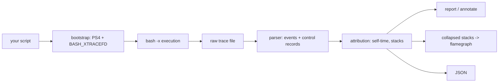

# bashprof

[English](README.md) | [中文](README.zh.md) | [日本語](README.ja.md)

[](LICENSE) [](Cargo.toml)  [](CONTRIBUTING.md)

**Open-source line-level time profiler for bash — see exactly which lines your scripts spend their time on, with flamegraph-ready output.**


```bash
git clone https://github.com/JaydenCJ/bashprof.git && cargo install --path bashprof
```

## Why bashprof?

CI setup scripts, dotfiles and deploy scripts waste minutes every day, and nobody knows *where*: `time` gives you one opaque number for the whole run, and the folklore fix — `PS4='+ $EPOCHREALTIME ' bash -x`, passed around in gists for a decade — dumps thousands of raw trace lines on stderr and leaves the subtraction, aggregation and loop-counting to you. bashprof productizes that trick: one command runs your script unmodified and answers with a per-line self-time table, call counts, per-function totals, an annotated source listing, and collapsed stacks you can feed straight into any flamegraph tool. The script keeps its own `$0`, arguments, stderr and exit code, so you can wrap a CI step in bashprof without changing its behavior.

|  | bashprof | `time` (builtin) | `PS4=$EPOCHREALTIME` folklore |
|---|---|---|---|
| Line-level self-time | yes, aggregated per `file:line` | no (whole run only) | raw timestamps, subtract by hand |
| Loop/call counts | yes (`COUNT` column, calls per function) | no | count lines yourself |
| Function stacks + flamegraph | yes (`collapse`, `file:line` leaves) | no | no |
| Script stderr stays clean | yes (trace goes to a private fd) | yes | no (xtrace floods stderr) |
| Strict mode (`set -u`, `IFS=$'\n\t'`) | handled | n/a | breaks (unguarded expansions) |
| Works as root / in containers | yes | yes | silently no (bash ≥5 ignores env `PS4` for root) |
| Exit code passthrough | yes | yes | yes |

## Features

- **One command, unmodified scripts** — `bashprof run ./setup.sh args...` runs the script with its own `$0`, positional parameters, stdin/stdout/stderr and exit code; the trace goes to a private file descriptor via `BASH_XTRACEFD`, so even scripts that inspect their stderr behave normally.
- **Self-time per line, honestly attributed** — a line that calls a function is charged only for the dispatch; the callee's lines carry their own time, so the numbers add up instead of double counting.
- **Flamegraph-ready collapsed stacks** — `bashprof collapse` emits `main;fetch_deps;setup.sh:12 366875` lines with `file:line` leaf frames; feed them to `flamegraph.pl`, inferno or speedscope as-is.
- **Annotated source** — `bashprof annotate` prints your script with time and count in the gutter; untouched lines show a bare gutter, which doubles as a coverage view.
- **Survives real-world bash** — strict mode (`set -euo pipefail`, `IFS=$'\n\t'`), locale comma timestamps, user EXIT traps, subshells, command substitution, background jobs and root/CI environments are all handled and tested.
- **Replayable raw traces** — `--out` keeps the trace (format documented in `docs/trace-format.md`); `report`, `collapse` and `annotate` re-analyze it offline, and `--json` gives stable machine-readable output.

## Quickstart

Install (requires Rust 1.75+ to build; bash 5.0+ at runtime for `EPOCHREALTIME`):

```bash
git clone https://github.com/JaydenCJ/bashprof.git && cargo install --path bashprof
```

Profile the bundled example:

```bash
bashprof run --top 6 examples/ci-setup.sh
```

Real captured output:

```text
setup complete
bashprof 0.1.0: examples/ci-setup.sh (exit 0)
total 774ms wall, 118 commands traced, 1 source file

     SELF       %   COUNT  LINE            COMMAND
    399ms   51.6%       3  ci-setup.sh:12  sleep 0.12
    354ms   45.8%       1  ci-setup.sh:17  sleep 0.35
   12.8ms    1.7%       1  ci-setup.sh:33  echo 'setup complete'
    2.4ms    0.3%       1  ci-setup.sh:7   set -euo pipefail
    2.3ms    0.3%       2  ci-setup.sh:27  CACHE_FILE=/tmp/tmp.9AN4lqyWmo
    2.0ms    0.3%      51  ci-setup.sh:22  for i in $(seq 1 50)
... 8 more lines; --top 0 shows all

FUNCTIONS (self-time)
    399ms   51.6%       1x  fetch_deps
    354ms   45.8%       1x  compile_assets
   17.6ms    2.3%        -  main
    2.9ms    0.4%       1x  warm_cache
```

Keep the raw trace and render a flamegraph:

```bash
bashprof run --out ci.trace examples/ci-setup.sh
bashprof collapse ci.trace > ci.folded   # -> flamegraph.pl / inferno / speedscope
bashprof annotate ci.trace               # per-line gutter view of the source
```

## Commands and options

`run` profiles live; `report`, `collapse` and `annotate` replay a trace saved with `--out`. `bashprof run` exits with the profiled script's exit code, so CI wrappers keep working.

| Option | Default | Effect |
|---|---|---|
| `--top <N>` | `15` | Rows in the hot-line table; `0` shows all |
| `--sort <KEY>` | `self` | `self` (slowest first), `count` (hottest loop first), `line` (source order) |
| `--min-us <N>` | `0` | Hide lines with less than N microseconds of self-time |
| `--json` | off | Machine-readable JSON instead of the table |
| `--out <FILE>` | temp file | (`run`) keep the raw trace for later replay |
| `--shell <PATH>` | `bash` | (`run`) which bash binary to profile with |
| `--script <FILE>` | recorded path | (`annotate`) source file to annotate |

## Accuracy and limitations

bashprof timestamps the start of every simple command and attributes the gap to the previous one — the same model as the folklore trick, but with the sharp edges filed off (locale radixes, `set -u`, root's PS4 ban, overridden EXIT traps, out-of-order background writes). Tracing costs roughly 10–20 µs per command on current hardware, negligible next to anything that forks. Honest limits for 0.1.0: compound keywords (`if`, `while`, function bodies as a whole) are not separate events — their cost lands on the lines inside them; background jobs interleave and negative gaps are clamped to zero; and a script that reassigns `PS4` or runs `set +x` mid-flight will blind the profiler from that point on.

## Architecture



## Roadmap

- [x] Core profiler: xtrace bootstrap, per-line/per-function self-time, hot-line report, annotated source, collapsed stacks, JSON output, replayable traces, exit-code passthrough
- [ ] `--flame` flag rendering an SVG flamegraph directly, no external tool
- [ ] Diff mode: compare two traces and show per-line regressions
- [ ] Attribute time inside `if`/`while` conditions to the keyword line
- [ ] zsh support via `PS4`/`%D{%s.%6.}` once the semantics are pinned down

See the [open issues](https://github.com/JaydenCJ/bashprof/issues) for the full list.

## Contributing

Contributions are welcome — see [CONTRIBUTING.md](CONTRIBUTING.md), start with a [good first issue](https://github.com/JaydenCJ/bashprof/issues?q=is%3Aissue+is%3Aopen+label%3A%22good+first+issue%22) or open a [discussion](https://github.com/JaydenCJ/bashprof/discussions).

## License

[MIT](LICENSE)
