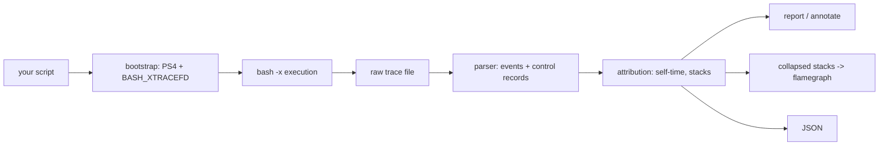

# bashprof

[English](README.md) | [中文](README.zh.md) | [日本語](README.ja.md)

[](LICENSE) [](Cargo.toml)  [](CONTRIBUTING.md)

**开源的 bash 逐行耗时 profiler——精确看到脚本的时间花在哪几行，输出直接可生成火焰图。**


```bash
git clone https://github.com/JaydenCJ/bashprof.git && cargo install --path bashprof
```

## 为什么是 bashprof？

CI 初始化脚本、dotfiles、部署脚本每天都在浪费几分钟，却没人知道浪费在*哪里*：`time` 只给整个运行一个笼统的数字；而流传了十年的民间偏方——`PS4='+ $EPOCHREALTIME ' bash -x`——把几千行原始 trace 倾倒到 stderr，减法、聚合、数循环次数全靠你自己。bashprof 把这个技巧产品化：一条命令原样运行你的脚本，直接给出逐行 self-time 表格、执行次数、逐函数汇总、带耗时批注的源码清单，以及可直接喂给任何火焰图工具的 collapsed stacks。脚本保留自己的 `$0`、参数、stderr 和退出码，所以可以放心地把 CI 步骤包进 bashprof 而不改变其行为。

|  | bashprof | `time`（内建） | `PS4=$EPOCHREALTIME` 偏方 |
|---|---|---|---|
| 逐行 self-time | yes，按 `file:line` 聚合 | no（只有整体） | 原始时间戳，减法自己做 |
| 循环/调用计数 | yes（`COUNT` 列 + 逐函数调用数） | no | 自己数行 |
| 函数栈 + 火焰图 | yes（`collapse`，叶帧为 `file:line`） | no | no |
| 脚本 stderr 保持干净 | yes（trace 走独立 fd） | yes | no（xtrace 淹没 stderr） |
| 严格模式（`set -u`、`IFS=$'\n\t'`） | 已处理 | n/a | 会崩（展开无保护） |
| root / 容器内可用 | yes | yes | 静默失效（bash ≥5 对 root 忽略环境 `PS4`） |
| 退出码透传 | yes | yes | yes |

## 特性

- **一条命令，脚本零改动** —— `bashprof run ./setup.sh args...` 让脚本保留自己的 `$0`、位置参数、stdin/stdout/stderr 和退出码；trace 经 `BASH_XTRACEFD` 走独立文件描述符，连检查自身 stderr 的脚本也表现如常。
- **逐行 self-time，归因诚实** —— 调用函数的那一行只记 dispatch 的开销；被调函数的行各记各的时间，数字加起来就是总数，不会重复计算。
- **火焰图就绪的 collapsed stacks** —— `bashprof collapse` 输出形如 `main;fetch_deps;setup.sh:12 366875` 的行，叶帧是 `file:line`；可原样喂给 `flamegraph.pl`、inferno 或 speedscope。
- **源码批注** —— `bashprof annotate` 在脚本每行左侧打印耗时与次数；从未执行的行留白，顺便就是一份行覆盖率视图。
- **经得起真实世界的 bash** —— 严格模式（`set -euo pipefail`、`IFS=$'\n\t'`）、locale 逗号时间戳、用户自己的 EXIT trap、子 shell、命令替换、后台任务、root/CI 环境，全部处理并有测试覆盖。
- **原始 trace 可回放** —— `--out` 保留 trace（格式见 `docs/trace-format.md`）；`report`、`collapse`、`annotate` 可离线重新分析，`--json` 提供稳定的机器可读输出。

## 快速上手

安装（构建需要 Rust 1.75+；运行时需要 bash 5.0+ 提供 `EPOCHREALTIME`）：

```bash
git clone https://github.com/JaydenCJ/bashprof.git && cargo install --path bashprof
```

对自带示例做 profile：

```bash
bashprof run --top 6 examples/ci-setup.sh
```

真实运行输出：

```text
setup complete
bashprof 0.1.0: examples/ci-setup.sh (exit 0)
total 774ms wall, 118 commands traced, 1 source file

     SELF       %   COUNT  LINE            COMMAND
    399ms   51.6%       3  ci-setup.sh:12  sleep 0.12
    354ms   45.8%       1  ci-setup.sh:17  sleep 0.35
   12.8ms    1.7%       1  ci-setup.sh:33  echo 'setup complete'
    2.4ms    0.3%       1  ci-setup.sh:7   set -euo pipefail
    2.3ms    0.3%       2  ci-setup.sh:27  CACHE_FILE=/tmp/tmp.9AN4lqyWmo
    2.0ms    0.3%      51  ci-setup.sh:22  for i in $(seq 1 50)
... 8 more lines; --top 0 shows all

FUNCTIONS (self-time)
    399ms   51.6%       1x  fetch_deps
    354ms   45.8%       1x  compile_assets
   17.6ms    2.3%        -  main
    2.9ms    0.4%       1x  warm_cache
```

保留原始 trace 并渲染火焰图：

```bash
bashprof run --out ci.trace examples/ci-setup.sh
bashprof collapse ci.trace > ci.folded   # -> flamegraph.pl / inferno / speedscope
bashprof annotate ci.trace               # 源码逐行耗时视图
```

## 命令与选项

`run` 实时 profile；`report`、`collapse`、`annotate` 回放用 `--out` 保存的 trace。`bashprof run` 以被测脚本的退出码退出，CI 包装照常工作。

| 选项 | 默认值 | 效果 |
|---|---|---|
| `--top <N>` | `15` | 热点行表格的行数；`0` 显示全部 |
| `--sort <KEY>` | `self` | `self`（最慢优先）、`count`（最热循环优先）、`line`（源码顺序） |
| `--min-us <N>` | `0` | 隐藏 self-time 少于 N 微秒的行 |
| `--json` | 关 | 输出机器可读 JSON 而非表格 |
| `--out <FILE>` | 临时文件 | （`run`）保留原始 trace 以便回放 |
| `--shell <PATH>` | `bash` | （`run`）用哪个 bash 二进制做 profile |
| `--script <FILE>` | 记录的路径 | （`annotate`）要批注的源文件 |

## 精度与限制

bashprof 给每条简单命令的开始打时间戳，把间隔归因到上一条命令——模型与民间偏方相同，但磨掉了所有毛刺（locale 小数点、`set -u`、root 的 PS4 禁令、被覆盖的 EXIT trap、后台乱序写入）。当前硬件上每条命令的 trace 开销约 10–20 µs，相比任何 fork 都可忽略。0.1.0 的诚实边界：复合关键字（`if`、`while`、函数体整体）不是独立事件——开销落在其内部的行上；后台任务会交错，负间隔被钳为零；脚本中途重设 `PS4` 或执行 `set +x` 会让 profiler 从那一刻起失明。

## 架构



## 路线图

- [x] 核心 profiler：xtrace bootstrap、逐行/逐函数 self-time、热点行报告、源码批注、collapsed stacks、JSON 输出、trace 回放、退出码透传
- [ ] `--flame` 直接渲染 SVG 火焰图，无需外部工具
- [ ] Diff 模式：对比两份 trace，展示逐行回归
- [ ] 把 `if`/`while` 条件的耗时归到关键字所在行
- [ ] 语义敲定后经 `PS4`/`%D{%s.%6.}` 支持 zsh

完整列表见 [open issues](https://github.com/JaydenCJ/bashprof/issues)。

## 参与贡献

欢迎贡献——见 [CONTRIBUTING.md](CONTRIBUTING.md)，可以从 [good first issue](https://github.com/JaydenCJ/bashprof/issues?q=is%3Aissue+is%3Aopen+label%3A%22good+first+issue%22) 入手，或发起 [discussion](https://github.com/JaydenCJ/bashprof/discussions)。

## 许可证

[MIT](LICENSE)
